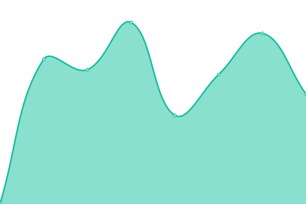
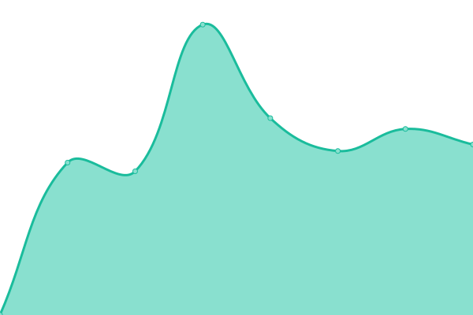
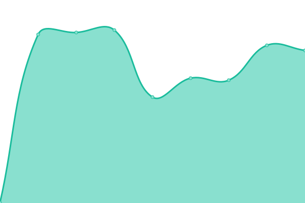
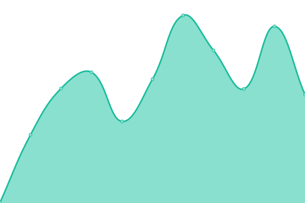

# [�🟢 Live Status](https://cannavit.github.io/upptime/): <!--live status--> **🟧 Partial outage**

This repository contains the open-source uptime monitor and status page for [CannIT](https://demo.upptime.js.org), powered by [Upptime](https://github.com/upptime/upptime).

With [Upptime](https://upptime.js.org), you can get your own unlimited and free uptime monitor and status page, powered entirely by a GitHub repository. We use [Issues](https://github.com/cannavit/upptime/issues) as incident reports, [Actions](https://github.com/cannavit/upptime/actions) as uptime monitors, and [Pages](https://demo.upptime.js.org) for the status page.

<!--start: status pages-->
<!-- This summary is generated by Upptime (https://github.com/upptime/upptime) -->
<!-- Do not edit this manually, your changes will be overwritten -->
<!-- prettier-ignore -->
| URL | Status | History | Response Time | Uptime |
| --- | ------ | ------- | ------------- | ------ |
|  [Anoki prenotazioni-api [production]](https://prenotazioni-api.cloud.anoki.it/reservation-be/swagger-ui.html) | 🟩 Up | [anoki-prenotazioni-api-production.yml](https://github.com/cannavit/upptime/commits/HEAD/history/anoki-prenotazioni-api-production.yml) | 

 1006ms
     
 | 

<a href="https://cannavit.github.io/upptime/history/anoki-prenotazioni-api-production">100.00%</a>
    

|  [Anoki prenotazioni-web [production]](https://prenota.cloud.anoki.it/) | 🟩 Up | [anoki-prenotazioni-web-production.yml](https://github.com/cannavit/upptime/commits/HEAD/history/anoki-prenotazioni-web-production.yml) | 

 1016ms
     
 | 

<a href="https://cannavit.github.io/upptime/history/anoki-prenotazioni-web-production">100.00%</a>
    

|  [Edutelling Web Product [production]](https://edutelling.it/) | 🟩 Up | [edutelling-web-product-production.yml](https://github.com/cannavit/upptime/commits/HEAD/history/edutelling-web-product-production.yml) | 

 873ms
     
 | 

<a href="https://cannavit.github.io/upptime/history/edutelling-web-product-production">100.00%</a>
    

|  [POT WEB [Staging]](https://pot-uat.paxitalia.com:5443) | 🟥 Down | [pot-web-staging.yml](https://github.com/cannavit/upptime/commits/HEAD/history/pot-web-staging.yml) | 

 0ms
     
 | 

<a href="https://cannavit.github.io/upptime/history/pot-web-staging">0.00%</a>
    

|  [POT API [Staging]](http://pot-uat.paxitalia.com:8443/api/public/auth/signin) | 🟥 Down | [pot-api-staging.yml](https://github.com/cannavit/upptime/commits/HEAD/history/pot-api-staging.yml) | 

 0ms
     
 | 

<a href="https://cannavit.github.io/upptime/history/pot-api-staging">0.00%</a>
    

|  [POT WEB [Production]](https://pot.paxitalia.com/) | 🟩 Up | [pot-web-production.yml](https://github.com/cannavit/upptime/commits/HEAD/history/pot-web-production.yml) | 

 588ms
     
 | 

<a href="https://cannavit.github.io/upptime/history/pot-web-production">100.00%</a>
    

|  [POT API [Production]](http://pot.paxitalia.com:8443/api/public/auth/signin) | 🟩 Up | [pot-api-production.yml](https://github.com/cannavit/upptime/commits/HEAD/history/pot-api-production.yml) | 

 336ms
     
 | 

<a href="https://cannavit.github.io/upptime/history/pot-api-production">99.46%</a>
    

<!--end: status pages-->

[**Visit our status website →**](https://demo.upptime.js.org)

## 📄 License

- Powered by: [Upptime](https://github.com/upptime/upptime)
- Code: [MIT](./LICENSE) © [CannIT](https://demo.upptime.js.org)
- Data in the `./history` directory: [Open Database License](https://opendatacommons.org/licenses/odbl/1-0/)
